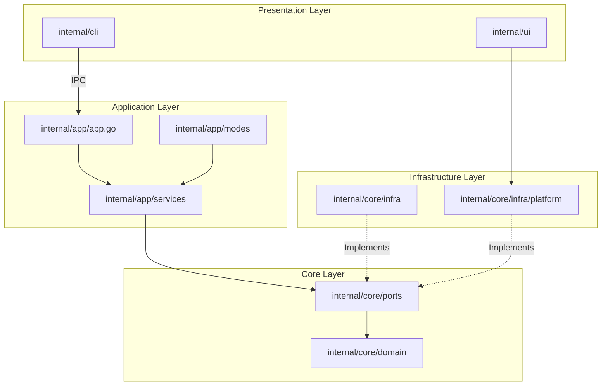
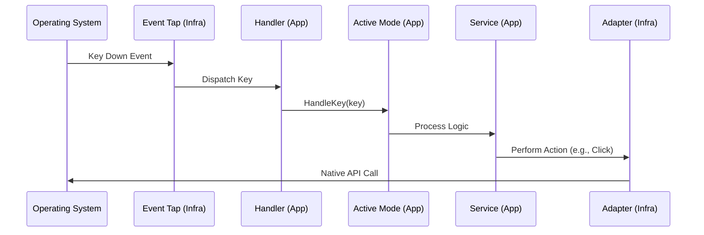

Neru is a keyboard-driven navigation tool built with Go and Objective-C. It uses a layered architecture inspired by **Hexagonal Architecture (Ports and Adapters)** for cross-platform extensibility.

## Architecture Overview

Neru operates as a background daemon that listens for global hotkeys and keyboard events. When activated, it provides several navigation modes:

- **Hints Mode**: Overlays unique character labels on clickable UI elements
- **Grid Mode**: Divides the screen into a coordinate-based grid system
- **Scroll Mode**: Provides Vim-style scrolling at the current cursor position
- **Recursive Grid Mode**: Recursive cell navigation with center preview and backtracking

## Hexagonal Architecture (Ports and Adapters)

Neru follows clean architecture with clear separation of concerns:



### Layer Responsibilities

<CardGroup cols={2}>
  <Card title="Domain Layer" icon="cube">
    **Location**: `internal/core/domain`
    
    Pure business logic with no external dependencies:
    - Entities (Hint, Grid, Element, Action)
    - Value objects (immutable data structures)
    - Business rules and validation
  </Card>
  
  <Card title="Ports Layer" icon="plug">
    **Location**: `internal/core/ports`
    
    Interfaces defining contracts between layers:
    - AccessibilityPort
    - OverlayPort
    - ConfigPort
    - InfrastructurePort
  </Card>
  
  <Card title="Application Layer" icon="gears">
    **Location**: `internal/app`
    
    Implements use cases and orchestrates domain entities:
    - Services (HintService, GridService, ActionService)
    - Components (UI components for modes)
    - Modes (navigation mode implementations)
    - Lifecycle (startup, shutdown, orchestration)
  </Card>
  
  <Card title="Infrastructure Layer" icon="server">
    **Location**: `internal/core/infra`
    
    Concrete implementations of ports:
    - Accessibility (platform API integration)
    - Overlay (UI overlay management)
    - EventTap (global input monitoring)
    - Platform adapters (darwin/linux/windows)
  </Card>
</CardGroup>

## Domain Concepts

### Mode

Navigational context that determines how the user interacts with the UI. All modes implement a standardized `Mode` interface:

```go
type Mode interface {
    // Activate initializes and starts the mode
    Activate(action *string)

    // HandleKey processes keyboard input during normal mode operation
    HandleKey(key string)

    // HandleActionKey processes keyboard input when in action sub-mode
    HandleActionKey(key string)

    // Exit performs cleanup and deactivates the mode
    Exit()

    // ToggleActionMode switches between normal mode and action sub-mode
    ToggleActionMode()

    // ModeType returns the domain mode type identifier
    ModeType() domain.Mode
}
```

### Bridge

Objective-C integration layer that connects Go code to macOS native APIs. Located in `internal/core/infra/platform/darwin/`.

### Adapter

Concrete implementation of a Port interface. Adapters translate between platform-specific APIs and the domain layer.

### Port

Interface definition for system capabilities (defined in `internal/core/ports/`). Examples:
- `AccessibilityPort`: UI element access and interaction
- `OverlayPort`: UI overlay management
- `SystemPort`: Platform system operations

## The "One Rule"

<Warning>
  **Non-darwin-tagged code must never import `internal/core/infra/platform/darwin`.**
  
  This rule is enforced by `golangci-lint` using `depguard`. Violation will cause CI to fail.
</Warning>

### Why This Rule Exists

1. **Platform Isolation**: OS-specific code is strictly isolated
2. **Build Safety**: Prevents accidental compilation of macOS-only code on other platforms
3. **Maintainability**: Clear boundaries between platform-specific and shared code

### How to Follow This Rule

- Use **Ports** to define platform-agnostic interfaces in `internal/core/ports/`
- Use **Adapters** to implement those interfaces in `internal/core/infra/`
- Use **Build Tags** (`//go:build darwin`) for OS-specific files
- Use the **Platform Factory** (`internal/core/infra/platform/factory.go`) to instantiate platform-specific implementations

## File Organization

### Platform-Specific Files

- `*_darwin.go`: macOS-specific code (build tag: `//go:build darwin`)
- `*_linux.go`: Linux-specific code (build tag: `//go:build linux`)
- `*_windows.go`: Windows-specific code (build tag: `//go:build windows`)
- `*_stub.go`: No-op implementations for unsupported platforms (build tag: `//go:build !darwin`)

### Example Structure

```bash
internal/core/infra/platform/
├── factory.go              # Platform-agnostic factory interface
├── factory_darwin.go       # macOS factory (//go:build darwin)
├── factory_linux.go        # Linux factory (//go:build linux)
├── darwin/                 # macOS implementations
│   ├── system.go
│   ├── accessibility_*.m
│   └── overlay_darwin.m
├── linux/                  # Linux implementations
│   └── system.go
└── windows/                # Windows implementations
    └── system.go
```

## Platform Status

| Capability                         | macOS | Linux            | Windows       |
| ---------------------------------- | ----- | ---------------- | ------------- |
| Screen bounds / cursor             | ✅    | 🔲 TODO          | 🔲 TODO       |
| Global hotkeys                     | ✅    | 🔲 TODO          | 🔲 TODO       |
| Keyboard event tap                 | ✅    | 🔲 TODO          | 🔲 TODO       |
| Accessibility (clickable elements) | ✅    | 🔲 TODO (AT-SPI) | 🔲 TODO (UIA) |
| UI overlays                        | ✅    | 🔲 TODO          | 🔲 TODO       |
| App watcher                        | ✅    | 🔲 TODO          | 🔲 TODO       |
| Dark mode detection                | ✅    | 🔲 TODO          | 🔲 TODO       |
| Notifications / alerts             | ✅    | 🔲 TODO          | 🔲 TODO       |
| Config / log directories           | ✅    | ⚠️ Partial       | ✅ (AppData)  |

🔲 = stub returns `CodeNotSupported`. Replace with real implementation.

## Data Flow

### Input Event Propagation



### Startup Flow

<Steps>
  <Step title="Configuration Loading">
    Configuration is loaded from TOML files in multiple locations.
  </Step>
  
  <Step title="Dependency Wiring">
    All components are wired together using manual dependency injection in `internal/app/app_initialization.go`.
  </Step>
  
  <Step title="Hotkey Registration">
    Global hotkeys are registered with the operating system.
  </Step>
  
  <Step title="Event Loop">
    App enters event loop and waits for user input.
  </Step>
</Steps>

## Adding New Features

### Navigation Modes

<Steps>
  <Step title="Define domain entities">
    Create entities in `internal/core/domain/`
  </Step>
  
  <Step title="Create service">
    Implement business logic in `internal/app/services/`
  </Step>
  
  <Step title="Implement infrastructure">
    Add platform-specific code in `internal/core/infra/`
  </Step>
  
  <Step title="Add components">
    Create UI components in `internal/app/components/`
  </Step>
  
  <Step title="Implement Mode interface">
    Create mode implementation in `internal/app/modes/` (see `HintsMode`, `GridMode` for examples)
  </Step>
  
  <Step title="Register mode">
    Add mode to Handler's mode map in `internal/app/modes/handler.go`
  </Step>
</Steps>

### Configuration Options

<Steps>
  <Step title="Add fields">
    Update structs in `internal/config/config.go`
  </Step>
  
  <Step title="Set defaults">
    Update `commonDefaultConfig()` for shared defaults, or `internal/config/config_<os>.go` for platform-specific defaults
  </Step>
  
  <Step title="Add validation">
    Implement validation in `Validate*()` methods
  </Step>
  
  <Step title="Update documentation">
    Update `configs/` examples and configuration reference docs
  </Step>
</Steps>

## Technology Stack

<CardGroup cols={2}>
  <Card title="Go 1.26+" icon="golang" href="https://golang.org/">
    Core application logic, CLI, configuration
  </Card>
  
  <Card title="CGo + Objective-C" icon="apple">
    macOS Accessibility API integration via native bridge
  </Card>
  
  <Card title="Cobra" icon="terminal" href="https://github.com/spf13/cobra">
    CLI framework for command parsing and dispatch
  </Card>
  
  <Card title="TOML" icon="file-code" href="https://toml.io/">
    Human-friendly configuration format
  </Card>
  
  <Card title="Unix Sockets" icon="network-wired">
    IPC communication between CLI and daemon
  </Card>
  
  <Card title="Just" icon="bolt" href="https://github.com/casey/just">
    Command runner for build automation
  </Card>
</CardGroup>

## Coordinate Systems

Neru uses a **global top-left (0,0) coordinate system** for all shared logic:

- **Origin**: (0,0) is the top-left corner of the primary display
- **Y-Axis**: Increases downwards
- **Units**: Screen pixels (unscaled)

### macOS Coordinate Inversion

macOS Cocoa APIs use a bottom-left (0,0) coordinate system where Y increases upwards. The darwin platform adapter is responsible for inverting the Y coordinate before passing it to shared Go code.

## Error Handling

Neru uses a custom error package (`internal/core/errors`) for structured error handling.

### The CodeNotSupported Policy

When a platform-specific feature is not yet implemented, the adapter must return an error with the `CodeNotSupported` code:

```go
return derrors.New(derrors.CodeNotSupported, "feature X not yet implemented on linux")
```

Callers in the service layer should use the `IsNotSupported(err)` helper to handle missing features gracefully.

## Further Reading

<CardGroup cols={2}>
  <Card title="Building" icon="hammer" href="/development/building">
    Set up your development environment
  </Card>
  
  <Card title="Coding Standards" icon="code" href="/development/coding-standards">
    Go and Objective-C conventions
  </Card>
  
  <Card title="Contributing" icon="users" href="/development/overview">
    How to contribute to Neru
  </Card>
  
  <Card title="GitHub Repository" icon="github" href="https://github.com/y3owk1n/neru">
    View the source code
  </Card>
</CardGroup>