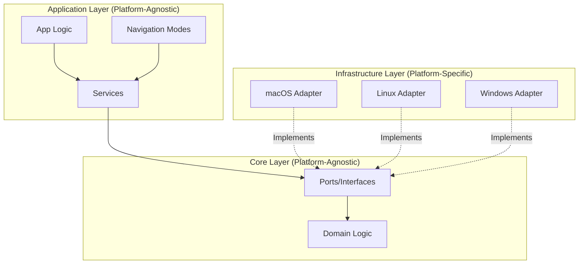

## Overview

Neru is architected from the ground up to be cross-platform, using a **Hexagonal Architecture (Ports and Adapters)** pattern that isolates OS-specific logic from core business rules.

This design enables a single codebase to support macOS, Linux, and Windows without polluting shared logic with platform-specific dependencies.

## Design Principles

Neru's cross-platform architecture follows four core principles:

### 1. Shared Business Logic

All core logic (hint generation, grid calculations, mode transitions) is written in pure Go and resides in `internal/core/domain` and `internal/app/services`.

This code is completely platform-agnostic and works identically across all operating systems.

### 2. Platform Isolation

OS-specific code is strictly isolated. Non-darwin code must never import macOS-specific packages.

<Warning>
**The "One Rule"**

Non-darwin-tagged code must never import `internal/core/infra/platform/darwin`.

Violation of this rule is caught by `golangci-lint` using `depguard`.
</Warning>

### 3. Ports and Adapters

System capabilities (Accessibility, Hotkeys, Overlays) are defined as interfaces (Ports) in `internal/core/ports`. Concrete implementations (Adapters) reside in `internal/core/infra`.

```go
// Port definition (platform-agnostic)
type AccessibilityPort interface {
    GetClickableElements() ([]Element, error)
    ClickElement(element Element) error
}

// Adapter implementation (platform-specific)
type DarwinAccessibilityAdapter struct { ... }
```

### 4. Build Tag Separation

OS-specific files use Go build tags (e.g., `//go:build darwin`) to ensure they are only compiled for the target platform.

```go
//go:build darwin
package platform

import "github.com/y3owk1n/neru/internal/core/infra/platform/darwin"
```

## Platform Status

### Current Support

<CardGroup cols={3}>
  <Card title="macOS" icon="apple">
    **100% Compatible**
    
    All features fully functional and stable.
  </Card>
  <Card title="Linux" icon="linux">
    **Foundations Ready**
    
    Infrastructure in place, native implementations needed.
  </Card>
  <Card title="Windows" icon="windows">
    **Foundations Ready**
    
    Infrastructure in place, native implementations needed.
  </Card>
</CardGroup>

### Compatibility Matrix

| Capability | macOS | Linux | Windows |
| :--------- | :---: | :---: | :-----: |
| **Screen bounds / cursor** | ✅ | 🔲 TODO | 🔲 TODO |
| **Global hotkeys** | ✅ | 🔲 TODO | 🔲 TODO |
| **Keyboard event tap** | ✅ | 🔲 TODO | 🔲 TODO |
| **Accessibility (clickable elements)** | ✅ | 🔲 TODO (AT-SPI) | 🔲 TODO (UIA) |
| **UI overlays** | ✅ | 🔲 TODO | 🔲 TODO |
| **App watcher** | ✅ | 🔲 TODO | 🔲 TODO |
| **Dark mode detection** | ✅ | 🔲 TODO | 🔲 TODO |
| **Notifications / alerts** | ✅ | 🔲 TODO | 🔲 TODO |
| **Config / log directories** | ✅ | ⚠️ Partial | ✅ (AppData) |

<Note>
**Legend**

- ✅ = Fully Supported
- 🔲 = Stub Implementation (returns `CodeNotSupported`)
- ⚠️ = Partially Implemented
</Note>

## Roadmap

Our goal is to make Neru the definitive keyboard-driven navigation tool for all major desktop platforms.

### Phase 1: macOS Refinement (Current)

- ✅ Stable core architecture
- ✅ High-performance native macOS bridge
- ✅ Comprehensive feature set

### Phase 2: Linux Expansion

- 🔲 AT-SPI accessibility integration
- 🔲 X11/Wayland event capture
- 🔲 Native Linux overlays

### Phase 3: Windows Expansion

- 🔲 UI Automation (UIA) integration
- 🔲 Windows Hooks for event capture
- 🔲 Win32/WinUI overlays

## Architecture Diagram



## Platform Factory Pattern

The platform factory is the gatekeeper for OS-specific code, returning the correct implementation without polluting shared code.

**Location**: `internal/core/infra/platform/factory.go`

```go
// factory.go (shared)
package platform

func NewSystemPort() ports.SystemPort {
    return newPlatformSystem()
}
```

```go
// factory_darwin.go
//go:build darwin
package platform

import "github.com/y3owk1n/neru/internal/core/infra/platform/darwin"

func newPlatformSystem() ports.SystemPort {
    return darwin.NewSystem()
}
```

## Get Involved

<CardGroup cols={2}>
  <Card title="Linux Support" icon="github" href="https://github.com/y3owk1n/neru/discussions/559">
    Join the Linux Support Discussion
  </Card>
  <Card title="Cross-Platform Issues" icon="tags" href="https://github.com/y3owk1n/neru/issues?q=is%3Aopen+is%3Aissue+label%3Across-platform">
    Browse cross-platform tasks
  </Card>
</CardGroup>

## Next Steps

<CardGroup cols={3}>
  <Card title="Porting Guide" icon="book" href="/development/porting-guide">
    Learn how to implement platform adapters
  </Card>
  <Card title="Linux Support" icon="linux" href="/development/linux-support">
    View Linux implementation status
  </Card>
  <Card title="Windows Support" icon="windows" href="/development/windows-support">
    View Windows implementation status
  </Card>
</CardGroup>